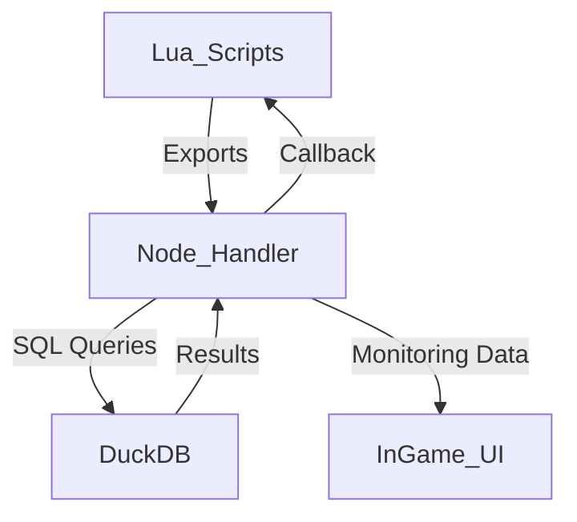

# Implementation Plan: FiveM Node.js Handler for DuckDB

## Objective
Develop a Node.js-based handler to replace MySQL dependencies (`mysql-async`, `oxmysql`) with DuckDB for FiveM. The system should:

1. Support **all MySQL 5.7 commands**.
2. Provide **drop-in compatibility** for existing FiveM scripts.
3. Include performance monitoring and an in-game UI for queries/edits.
4. Enable seamless integration between Lua and Node.js with minimal changes.

---

## Features and Requirements

### Core Features
1. **MySQL 5.7 Command Support**
   - Implement full compatibility with MySQL commands commonly used in FiveM resources (e.g., `SELECT`, `INSERT`, `UPDATE`, `DELETE`, `JOIN`).

2. **DuckDB Integration**
   - Use the Node.js `duckdb` package to handle database interactions.
   - Maintain a persistent `.duckdb` file as the database storage.

3. **Lua to Node.js Unification**
   - Provide a seamless interface for Lua scripts to interact with DuckDB via Node.js.

4. **Performance Monitoring**
   - Track query execution times, memory usage, and concurrency metrics.

5. **In-Game Management UI**
   - An NUI-based interface to allow players with appropriate ACE permissions to:
     - View database performance stats.
     - Run SQL queries.
     - Make real-time edits.

### Optional Enhancements
- **Data Migration Tool**
  - Provide a script to migrate existing MySQL databases to DuckDB.

---

## Architecture Overview



---

## Development Phases

### Phase 1: DuckDB Integration
1. **Install Dependencies**
   ```bash
   npm install duckdb
   npm install fivem-server-utils
   ```

2. **Set Up Database Connection**
   Create a DuckDB instance and load a persistent `.duckdb` file.
   ```javascript
   const duckdb = require('duckdb');
   const db = new duckdb.Database('braindeadrp.duckdb');
   ```

3. **Core Query Execution Function**
   Implement a generic function to execute SQL queries.
   ```javascript
   async function executeQuery(query, params = []) {
       return new Promise((resolve, reject) => {
           db.all(query, params, (err, rows) => {
               if (err) reject(err);
               else resolve(rows);
           });
       });
   }
   ```

4. **Support MySQL-Like Syntax**
   - Parse and transform any MySQL-specific syntax into DuckDB-compatible queries.
   - Example: Replace `AUTO_INCREMENT` with DuckDB's equivalent functionality.

---

### Phase 2: Lua-Node.js Bridge

1. **Expose Node.js Functions to Lua**
   Use FiveM’s `exports` mechanism to make DuckDB operations available in Lua scripts.
   ```javascript
   exports('query', async (query, params) => {
       return await executeQuery(query, params);
   });
   ```

2. **Create Drop-In Compatibility Layer**
   Provide functions that match the `mysql-async` API.
   ```javascript
   exports('mysql_fetch_all', async (query, params) => {
       return await executeQuery(query, params);
   });

   exports('mysql_insert', async (query, params) => {
       const result = await executeQuery(query, params);
       return result.insertId; // Simulate MySQL's insert ID behavior.
   });
   ```

---

### Phase 3: In-Game Management UI

1. **Build the NUI Frontend**
   - Use a modern frontend framework (e.g., React, Vue.js) for the interface.
   - Features:
     - Query execution panel.
     - Database performance stats.
     - Real-time data editor.

2. **Backend for UI**
   Add endpoints in the Node.js handler to serve data to the NUI.
   ```javascript
   app.post('/execute-query', async (req, res) => {
       const { query } = req.body;
       try {
           const result = await executeQuery(query);
           res.json(result);
       } catch (err) {
           res.status(400).json({ error: err.message });
       }
   });
   ```

3. **Lua ACE Permissions**
   Restrict access to the management UI using FiveM’s ACE permissions.
   ```lua
   if IsPlayerAceAllowed(source, "db.admin") then
       -- Grant access to the UI
   end
   ```

---

### Phase 4: Testing and Optimization

1. **Unit Tests**
   Use `mocha` or `jest` for Node.js tests:
   ```bash
   npm install mocha chai
   ```

   Example Test:
   ```javascript
   const { expect } = require('chai');
   describe('executeQuery', () => {
       it('should return correct results for a SELECT query', async () => {
           const result = await executeQuery('SELECT 1 + 1 AS sum');
           expect(result[0].sum).to.equal(2);
       });
   });
   ```

2. **Stress Testing**
   Simulate high-concurrency scenarios to ensure DuckDB handles the workload.

3. **In-Game Validation**
   - Use a custom FiveM resource to test:
     - Query execution.
     - Real-time edits via the NUI.

---

## Final Deliverables
1. **Node.js Handler**
   - Fully compatible with MySQL 5.7 syntax.
   - Implements all required functions for Lua scripts.

2. **NUI Management UI**
   - A polished interface for monitoring and managing the database.

3. **Documentation**
   - Installation and configuration guide.
   - API documentation for Lua developers.

4. **Testing Suite**
   - Unit tests and stress testing scripts.

---

## Example Lua Script Using the New Handler
```lua
local result = exports['duckdb-handler']:query("SELECT * FROM users WHERE id = ?", {1})
for _, row in ipairs(result) do
    print(row.username)
end
```

---

## Conclusion
This implementation plan provides a robust and scalable solution to migrate from MySQL to DuckDB for FiveM. It ensures compatibility with existing resources, adds valuable monitoring tools, and reduces dependency on external database servers. Once implemented, it will significantly streamline database operations and maintenance for your FiveM server.

